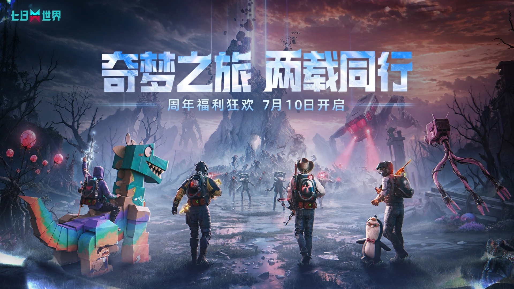
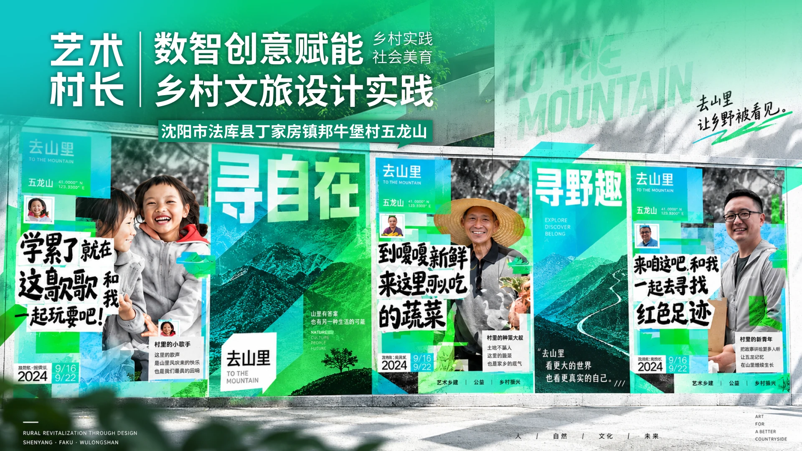
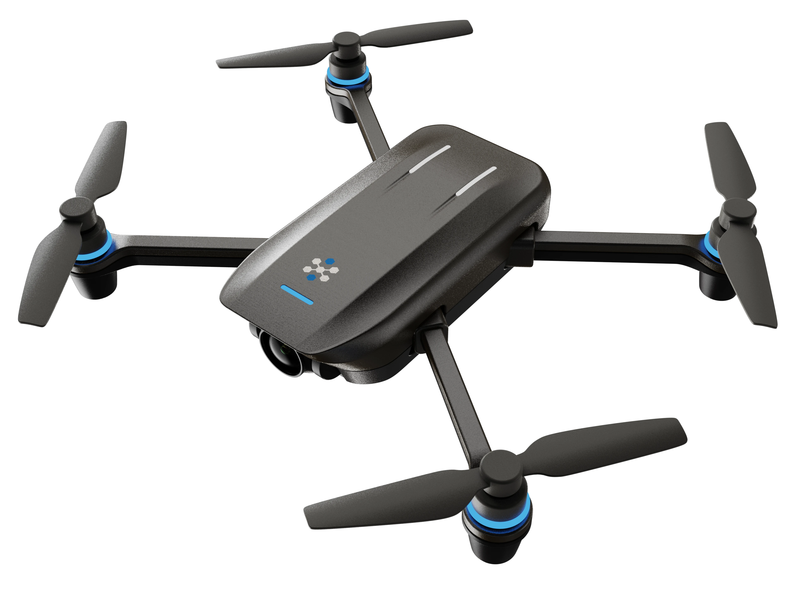

<div align="center">

# SHAO XINYE · PORTFOLIO 2026

**AI 产品 · 内容运营 · 用户体验 · 视觉系统**

以设计思维连接用户、内容与业务，将复杂信息转化为清晰、可执行、可交付的体验。

[**在线访问作品集 ↗**](https://sxy-portfolio-2026-ochre.vercel.app/)　·　[查看在线简历](https://sxy-portfolio-2026-ochre.vercel.app/resume-shao-xinye-2027.pdf)　·　[联系我](mailto:1491557105@qq.com)

</div>

[](https://sxy-portfolio-2026-ochre.vercel.app/)

## 关于这个作品集

这是邵歆晔面向 **AI 产品、内容运营、用户体验与视觉设计** 方向制作的个人作品集网站。内容覆盖游戏全球营销、智能汽车技术传播、乡村振兴服务设计、无人机公共服务系统，以及主视觉、动态影像、三维建模和工业涂装等项目。

网站不仅展示最终画面，也重点说明项目背景、问题拆解、设计过程、协作方式与落地成果。

## 精选项目

| 项目 | 方向 |
| --- | --- |
| [网易游戏｜《七日世界》](https://sxy-portfolio-2026-ochre.vercel.app/projects/netease-once-human) | 全球营销、渠道视觉、AI 内容生产 |
| [理想汽车｜算力平台](https://sxy-portfolio-2026-ochre.vercel.app/projects/li-auto) | 技术内容运营、信息可视化、视觉系统 |
| [艺术村长｜乡村振兴](https://sxy-portfolio-2026-ochre.vercel.app/projects/art-village) | 服务设计、实地调研、线下触点 |
| [天网寻踪｜无人机搜寻系统](https://sxy-portfolio-2026-ochre.vercel.app/projects/skynet-search) | 产品体验、服务流程、软硬件系统 |
| [Other Works｜跨媒介作品](https://sxy-portfolio-2026-ochre.vercel.app/projects/other-works) | 主视觉、数字动画、三维、工业涂装 |

<table>
  <tr>
    <td width="50%"><a href="https://sxy-portfolio-2026-ochre.vercel.app/projects/netease-once-human"></a></td>
    <td width="50%"><a href="https://sxy-portfolio-2026-ochre.vercel.app/projects/li-auto"></a></td>
  </tr>
  <tr>
    <td align="center"><strong>网易游戏｜《七日世界》</strong></td>
    <td align="center"><strong>理想汽车｜算力平台</strong></td>
  </tr>
  <tr>
    <td width="50%"><a href="https://sxy-portfolio-2026-ochre.vercel.app/projects/art-village"></a></td>
    <td width="50%"><a href="https://sxy-portfolio-2026-ochre.vercel.app/projects/skynet-search"></a></td>
  </tr>
  <tr>
    <td align="center"><strong>艺术村长｜乡村振兴</strong></td>
    <td align="center"><strong>天网寻踪｜无人机搜寻系统</strong></td>
  </tr>
</table>

## 核心能力

- **AI 视觉制作**：渠道 KV、商店图、UA 素材、多尺寸延展与交付。
- **内容与动效**：将脚本和卖点转化为 AI 漫剧、投放视频及短视频内容。
- **AI 工作流**：使用生成式 AI 建立可复用的探索、制作和迭代流程。
- **系统与体验**：从场景和任务流程出发，组织产品、服务与视觉系统。
- **品牌传播**：把技术与文化内容转译为清晰、可延展的品牌语言。

## 网站体验

- 响应式首页与项目长页，适配桌面端和移动端。
- 首页动态封面、加载动画、签名轨迹与悬浮交互。
- 固定项目目录，可快速浏览四个核心项目和五个子项目。
- 项目页使用 Aurora 流光背景、动效预览与多媒体内容。
- 背景音乐支持首页播放、手动开关和页面状态管理。

## 技术栈

`Next.js` · `React` · `TypeScript` · `Framer Motion` · `Three.js` · `React Three Fiber` · `OGL` · `Vercel`

## 本地运行

```bash
pnpm install
pnpm dev
```

默认开发地址为 `http://localhost:3000`。生产构建使用：

```bash
pnpm exec next build
```

## 发布与更新

网站通过 GitHub 与 Vercel 持续部署。`main` 分支更新后，Vercel 会自动构建并发布到固定 Production 地址：

**https://sxy-portfolio-2026-ochre.vercel.app/**

## 联系方式

- Email：[1491557105@qq.com](mailto:1491557105@qq.com)
- Portfolio：[sxy-portfolio-2026-ochre.vercel.app](https://sxy-portfolio-2026-ochre.vercel.app/)

---

<div align="center">

© 2026 Shao Xinye. Portfolio content and visual assets are presented for personal recruitment and academic communication.

</div>
